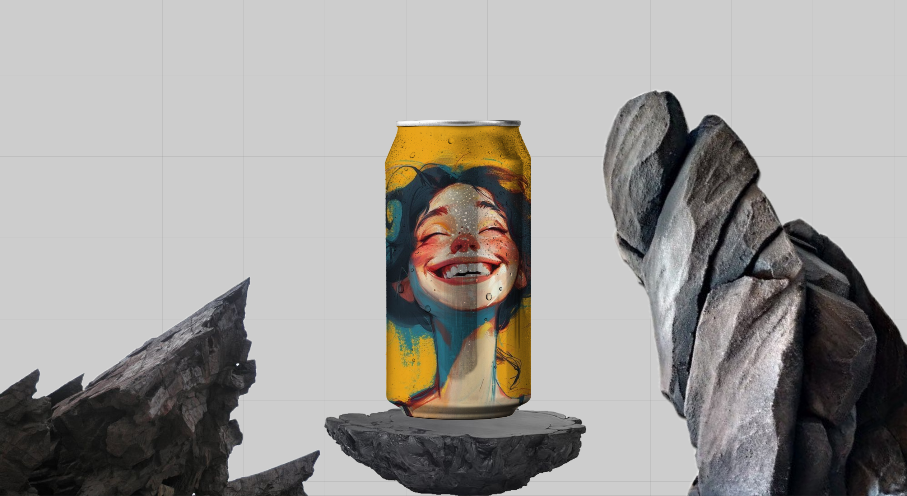

### Projeto feito para fiz comerciais, referente a uma marca de soda 🥤
#### Fique a vontade para navegar, em caso de dúvidas estou disponível 24/7 para você 🫵

    
    

#### Link para o Site 🎯

    

#### ⬇️Pode me chamar no⬇️

 
    
    
    
     
    <h2>vinii.viniciusribeiro@gmail.com</h2>

#### Tecnologias utilizadas neste projeto 🤖

 
 
 
 
 

#### Conhecimentos Adquiridos durante o processo 🤓

- Para colocar um elemento no meio sem display basta colocar:
    left: 50%;
    transform: translateX(-50%);

- Para ajustar o tamanho de uma imagem de forma mais responsiva basta colocar:
    aspect-ratio: 2 / 4;

- Para imprimir uma imagem em outra com os mesmo aspectos basta colocar:
    background-blend-mode:multiply;

- Para colocar uma imagem com o mesmo formato basta colocar:
    mask-image: url(img/soda.png);
    mask-size: auto 100%;